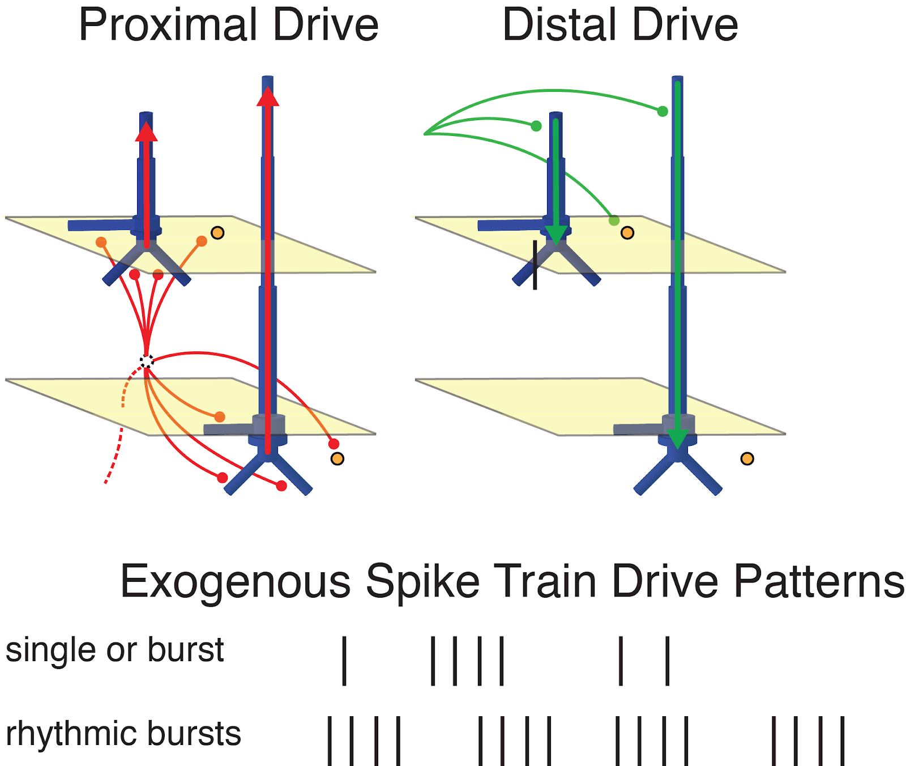

# Overview
We demonstrate how to use the HNN software to simulate several of the most commonly recorded EEG/MEG signals, including event related potentials (ERPs) and low-frequency rhythms:

1. Event Related Potentials (ERPs) (0-175ms)
2. Alpha (7-14Hz) and Beta Rhythms (15-29Hz)
3. Gamma Rhythms (30-80Hz).

These examples are based on our published studies investigating spontaneous and evoked neural dynamics source localized to the primary somatosensory cortex [1–5]. By learning how to simulate these signals, you will gain a general sense of the workflow to begin testing hypotheses on the origin of your data. The HNN software provides a canonical neocortical circuit, data sets, and initial parameter sets to work with, based on our prior studies. We take you step-by-step through the parameter settings required to replicate our experimental data, describe how to compare experimental data to the model output, and how to adjust parameters to test alternate hypotheses on signal generation. Each tutorial is based on a simulation “experiment” with the following workflow:

1. Load your data (optional)

2. Load a cortical column network structure (starting template is provided – see Overview & Uniqueness).

3. “Activate” the local network by defining layer specific driving inputs (templates provided). The driving input can be in the form of (i) spike trains (single spikes or bursts of rhythmic input) that activate post-synaptic targets in the local network, (ii) current clamps (tonic drive), or (iii) noisy background drive. The framework of the spike train drive is discussed below.

4. Run the simulation and visualize (i) net current dipole activity in the time and/or frequency domain, (ii) layers specific dipole activity, (iii) spiking activity of individual cells

5. Adjust parameters and repeat to explore how the model can account for your data

Before starting the tutorials, it is necessary to understand the framework for the adjustable spike train drive in HNN’s template network. This framework is based on known layer specific patterns of synaptic input to cortical circuits. Local cortical networks receive synaptic input from spiking activity in other parts of the brain through two primary projection pathways. One pathway, representative of the pathway from lemniscal thalamus to cortex, arrives in granular layers and propagates to the proximal dendrites of neocortical pyramidal neurons (the source of the primary dipole current – see [Overview & Uniqueness](https://hnn.brown.edu/index.php/overview-uniqueness/)). HNN refers to this as proximal drive, as shown in red below. The other pathway represents input from higher order cortical areas or non-lemniscal input to the distal dendrites of neocortical pyramidal neurons supragranular layers. HNN refers to this as distal drive, as shown in green below.

HNN allows you to define and adjust trains of action potentials that generate excitatory synaptic drive to targets in the the local cortical network through these two pathways. There are several ways to change the pattern of action potential drive through different “buttons” build into the HNN GUI: “evoked response”, “rhythmic proximal” and “rhythmic distal”. The dialog boxes that open with these buttons allow creation and adjustment of a patterns of evoked response drive or rhythmic drive to the network. These design features are motivated by our prior studies. We have simulated evoked responses through a sequence of proximal and distal spike train drive [1-2], this sequence is provided as default parameters set to begin simulating evoked responses; parameters can be adjusted and additional inputs can be created in “evoked response” dialog box, as detailed further in the evoked response tutorial below. We have simulated low frequency alpha and beta rhythms through patterns of rhythmic drive (repeated bursts of spikes) through proximal and distal projection pathways [1,3-4]. Default parameters sets to begin simulating low frequency rhythms via rhythmic drive are provided; parameters can be adjusted in the corresponding dialog boxes, as detailed further in the alpha/beta tutorial below.

## References
[1] Jones, S. R., Pritchett, D. L., Stufflebeam, S. M., Hämäläinen, M. & Moore, C. I. Neural correlates of tactile detection: a combined magnetoencephalography and biophysically based computational modeling study. J. Neurosci. 27, 10751–10764 (2007).

[2]    Jones, S. R. et al. Quantitative analysis and biophysically realistic neural modeling of the MEG mu rhythm: rhythmogenesis and modulation of sensory-evoked responses. J. Neurophysiol. 102, 3554–3572 (2009).

[3]    Ziegler, D. A. et al. Transformations in oscillatory activity and evoked responses in primary somatosensory cortex in middle age: a combined computational neural modeling and MEG study. Neuroimage 52, 897–912 (2010).

[4] Lee, S. & Jones, S. R. Distinguishing mechanisms of gamma frequency oscillations in human current source signals using a computational model of a laminar neocortical network. Front. Hum. Neurosci. 7, 869 (2013).

[5] Sherman M, Lee S, Law R, Haegens S, Thorn C, Hamalainen M, Moore CI, Jones SR. (2016) Neural mechanisms of transient neocortical beta rhythms: Converging evidence from humans, computational modeling, monkeys, and mice. Proc. Natl. Acad. Sci.; (2016 Epub).

