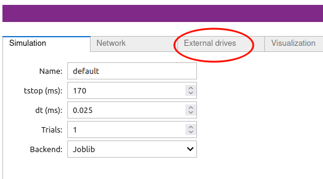
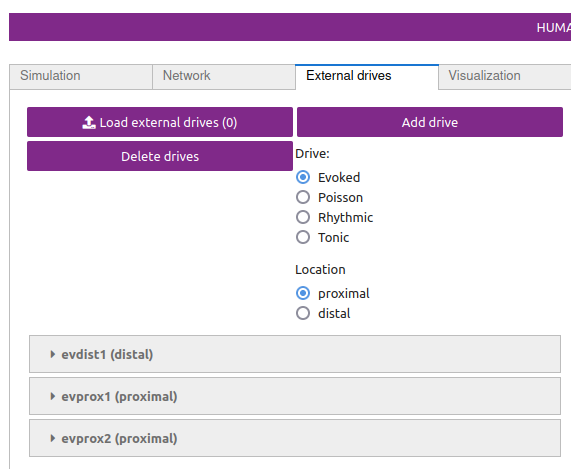
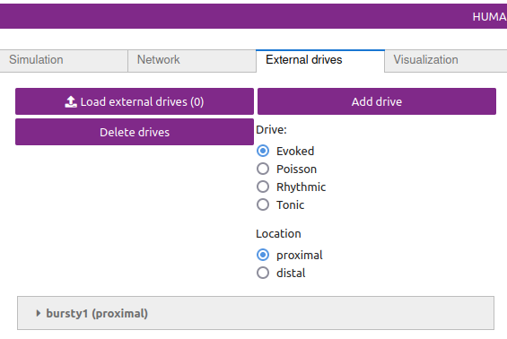

# Alpha (7-14 Hz) and Beta (15-29 Hz) Rhythms: The Mu-Complex #
## Getting Started ##

In order to understand the workflow and initial parameter sets provided with this tutorial, we must first briefly describe prior studies that led to the creation of the data you will aim to simulate. This tutorial is based on results from Jones et al. 2009 where, using MEG, we recorded spontaneous (pre-stimulus) alpha (7-14 Hz) and beta (15-20 Hz) rhythms that arise as part of the mu-complex from the primary somatosensory cortex (S1) [1]. (Figure 1. See also [2-4].)

<div class="stylefig"  style="max-width:650px;">

<h3>Figure 1</h3>

<a href="https://raw.githubusercontent.com/jonescompneurolab/hnn-tutorials/master/alpha_and_beta/images/image3.png"></a>
<p align="justify">
<b>Left:</b> Spectrogram of spontaneous activity from current dipole source in SI averaged across 100 trials, from an example subject, shows nearly continuous prestimulus alpha and beta oscillations. At time zero, a brief tap was given to the contralateral finger tip and the spontaneous oscillations briefly desynchronized.</p>

<p align="justify"><b>Right:</b> A closer look at the prestimulus waveform and spectrogram from spontaneous activity during example signal trials, shows that the alpha and beta oscillations occur intermittently and primarily non-overlapping.</span>
</p>
</div>

Our goal was to use our neocortical model to reproduce features of the waveform and spectrogram observed on single unaveraged trials (Figure 2 top panel, right) where the alpha and beta components emerge briefly and intermittently in time. On any individual trial (i.e., 1 second of spontaneous data), the presence of alpha and beta activity is not time locked and representative of so-called “induced” activity. Seemingly continuous bands of activity occur only when averaging the spectrograms across trials (Figure 2 top panel, left), and this is due to the fact that the spectrograms values are strictly positive and the alpha and beta events accumulate without cancellation [4].

<div class="stylefig"  style="max-width:650px;">

<h3>Figure 2</h3>

<a href="https://raw.githubusercontent.com/jonescompneurolab/hnn-tutorials/master/alpha_and_beta/images/image29.png"></a>
<p align="justify">Key features of the spontaneous non-average SI alpha/beta complex include, intermittent transient bouts of alpha/beta activity, a waveform that oscillates around 0nAm, PSD with peaks in the alpha and beta bands, primarily non-overlapping alpha and beta events, and a symmetric waveform oscillation. The model was able to reproduce each of these features.</p>

</div>

We found that a sequence of exogenous subthreshold excitatory synaptic drive could activate the network in a manner that reproduced important features of the SI rhythms in the model (Figure 2). This drive consisted of two nearly-synchronous 10 Hz rhythmic drives that contacted the network through proximal and distal projection pathways (Figure 3). The drives were simulated as population “bursts” of action potentials that contacted the network every 100ms with the mean delay between the proximal and distal burst of 0ms. Specifically, as shown schematically in Figure 3, the population bursts consisted of 10, 2-spike bursts Gaussian distributed in time. We presumed that during such spontaneous activity, these drives may be provided by leminscial and non-lemniscal thalamic nuclei, which contact proximal and distal pyramidal neurons respectively, and they are know to burst fire at  ~10 Hz frequencies in spontaneous states [5,6].

<div class="stylefig" style="max-width: 650px;">

<h3>Figure 3</h3>

<a href="https://raw.githubusercontent.com/jonescompneurolab/hnn-tutorials/master/alpha_and_beta/images/image4.png">
</a>
<p align="justify">Schematic illustration of exogenous 10 Hz burst drive through proximal and distal projection pathways.  “Population bursts”, consisting of a set number of “burst units” (10, 2-spike bursts shown) drive post-synaptic conductances in the local network with a set frequency (100 ms ISI) and mean delay between proximal and distal. </p>
</div>

We assumed that the macroscale rhythms generating the observed alpha and beta activity arose from subthreshold current flow in a large population of neurons, as opposed to being generated by local spiking interaction. As such, the effective strengths of the exogenous driving inputs were tuned so that the cells in the network remained subthreshold (all other parameters were tuned and fixed base on the morphology, physiology and connectivity within layered neocortical circuits, see Jones et al. 2009 [1] for details). The inputs drove subthreshold currents up and down the pyramidal neurons to reproduce accurate waveform and spectrogram features (see Figure 3). A scaling factor of 3000 was multiplied by the model waveform to reproduce nAm units comparable to the recorded data, suggesting on the order 200 x 3000 = 600,000 pyramidal neurons contributed to this signal.

We further found that decreasing the delay between the drives to ~50ms created a pure alpha oscillation, while applying an ~0ms delay caused beta events to emerge and increased the strength of the distal drive, creating stronger beta activity (data not shown; see parameter exploration below). This result led to the novel prediction that brief beta events emerge from a broad proximal drive disrupted by a simultaneous strong distal drive that lasted 50ms (i.e., one beta period). Support for this prediction was found invasively with laminar recordings in mice and monkeys [3].

In this tutorial, we will explore parameter changes that illustrate these results. We will walk you step-by-step through simulations with various combinations of rhythmic proximal and distal drives to describe how each contributes to the alpha and beta components of the SI alpha/beta complex rhythm. We will begin by simulating only rhythmic proximal alpha frequency inputs (Step 1), followed by simulating only distal alpha frequency inputs (Step 2), followed by various combinations of proximal and distal drive to generate alpha and beta rhythms. We’ll show you how HNN can plot waveforms, time-frequency spectrograms, and power spectral density plots of the simulated data, as well as for imported recorded data.

## Tutorial Table of Contents

1\. [Simulating Rhythmic Proximal Inputs: Alpha only](#toc_one)

2\. [Simulation Rhythmic Distal Inputs: Alpha only](#toc_two)

3\. [Simulating Combined Rhythmic Proximal and Distal Inputs: Alpha/Beta Complex](#toc_three)

4\. [Calculating and Viewing Power Spectral Density (PSD)](#toc_four)

5\. [Comparing model output and recorded data](#toc_five)

6\. [Adjusting parameters](#toc_six)

7\. [Have fun exploring your own data!](#toc_seven)

<!-- -->
<!-- -->
<!-- the above lines of text have been reviewed -->
<!-- -->
<!-- -->

<a id="toc_one"></a>

## 1. Simulating Rhythmic Proximal Inputs: Alpha Only

Note that before running/loading new simulations, we first remove the prior simulation(s) by pressing the “Remove Simulation” button at the bottom of the GUI. If we do not do this, both simulation dipoles are displayed (the old simulation is displayed with a dotted line, new simulation with a solid line; see “Tour of the GUI” for more details on simulation controls).

### 1.1 Load/view parameters to define the network structure & to “activate” the network.  

As described in the “Getting Started” section, low-frequency alpha and beta rhythms can be simulated by a combination of rhythmic subthreshold proximal and distal ~10Hz inputs. Here, we begin by describing the impact of proximal inputs only. An initial parameter set that will simulate the effect of ~10 Hz subthreshold proximal drive is provided in the file [OnlyRhythmicProx.json](https://raw.githubusercontent.com/jonescompneurolab/hnn-data/refs/heads/main/network-configurations/OnlyRhythmicProx.json).


The template cortical column networks structure for this simulation is described in the [Overview](https://www.google.com/url?q=https://hnn.brown.edu/index.php/overview-uniqueness/&sa=D&ust=1552525363605000) and [Under the Hood](https://www.google.com/url?q=https://hnn.brown.edu/index.php/under-the-hood/&sa=D&ust=1552525363605000) sections. Several of the network parameter can be adjusted via the HNN GUI (e.g. local excitatory and inhibitory connection strengths), but we will leave them fixed for this tutorial and only adjust the inputs the “activate” the network.


To load the initial parameter set, navigate to the HNN GUI and click the tab labeled:

```
External drives
```

Then inside of the inside of the tab, click the button

```
Load external drives (0)
```

And select the file [OnlyRhythmicProx.json](https://raw.githubusercontent.com/jonescompneurolab/hnn-data/refs/heads/main/network-configurations/OnlyRhythmicProx.json) from HNN’s param subfolder or from your local machine. 


To view the parameters that “activate” the network via rhythmic proximal input, click the dropdown menu labeled:

```
bursty1 (proximal)
```

<div class="stylefig" style="max-width: 650px;">
<table>
<h3>Figure 4</h3>
<tr>
<td>
<a href=""></a>
</td>
<td>
<a href=""></a>
</td>
<td>
<a href=""></a>
</td>
</tr>
</table>
</div>

You should see the values of adjustable parameters displayed as in the dialog boxes below. There are 4 sections, one regulating the timing statistics of the driving input, one regulating the post-synaptic conductances onto the Layer 2/3 neurons, and one regulating the post-synaptic conductances onto the Layer 5 neurons, and one regulating the synaptic delays. We describe adjustable parameters in each dialog box separately.

<div class="stylefig" style="max-width: 650px;">
<table>
<h3>Figure 5</h3>
<tr>
<td>
<a href=""></a>
</td>
<td>
<a href=""></a>
</td>
<td>
<a href=""></a>
</td>
</tr>
</table>
</div>

Timing tab: The rhythmic proximal inputs drive excitatory synapses in the neocortical network in a proximal projection pattern, as shown at the bottom of the dialog box. For further details on the connectivity structure of the network, see the Under the Hoodsection of the HNN website. Rhythmic proximal input occurs through stochastic, presynaptic bursts of action potentials from a population of bursting cells (set with “Number bursts”; see Figure 3) onto postsynaptic neurons of the modelled network. Stochasticity is introduced in two places: the spike train start time for each bursting cell is sampled from a normal distribution with mean “Start time mean (ms)” and standard deviation “Start time stdev (ms)” and the inter-burst intervals for each bursting cell are sampled from a normal distribution of mean (e.g., a 100 ms inter-burst interval corresponds to a “Burst frequency” of 10 Hz) and standard deviation “Burst stdev (ms)” (see Figure 3). Also note that the number of spikes per burst unit is set with “Spikes/burst” (currently, only values of 1 and 2 with a fixed 10ms delay can be used) and the final stop time for the entire population of rhythmic proximal inputs is set with “Stop time (ms)”.

Layer 2/3, and Layer 5 tabs: This dialog box allows you to set the postsynaptic conductance of each of the excitatory synapses in the networks. There are AMPA and NMDA receptors on each cell type (pyramidal and basket cells). There is also a delay parameter to control the arrival time of each spike to the network. In this example, the delay to the layer 2/3 cells is 0.1 ms, with a slightly longer delay to the layer 5 cells of 1 ms. For further details on the connectivity structure of the network, see Under the Hood.

XX TODO: DESCRIBE SYNPATIC DELAYS XX

