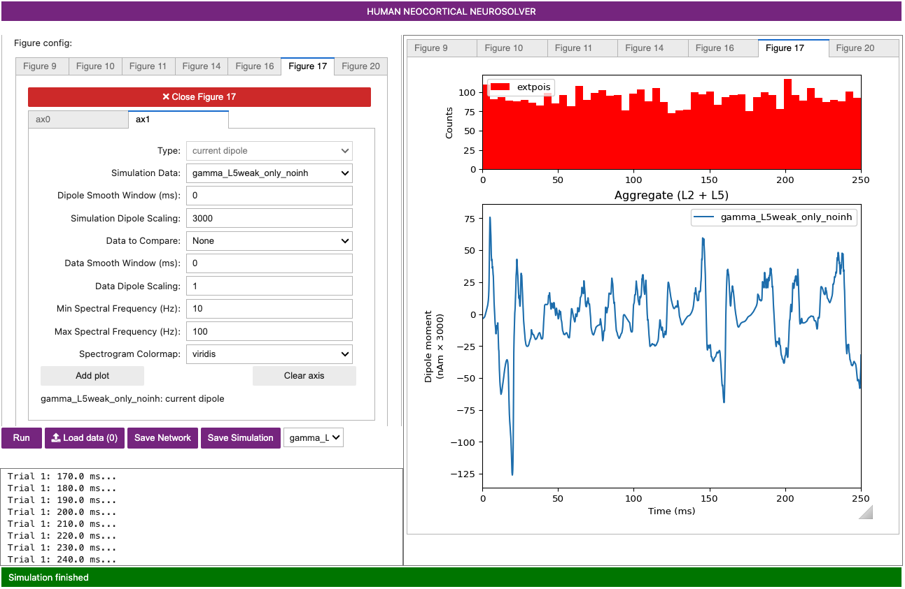
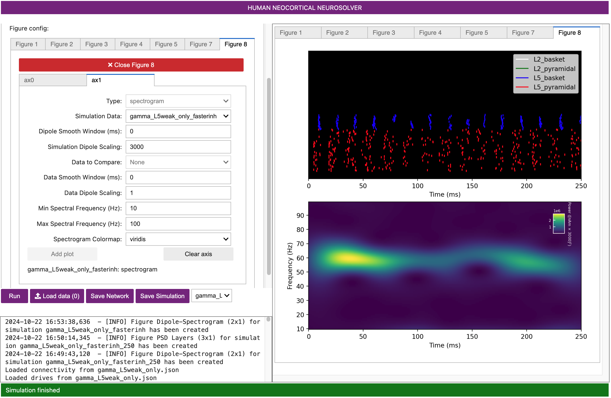
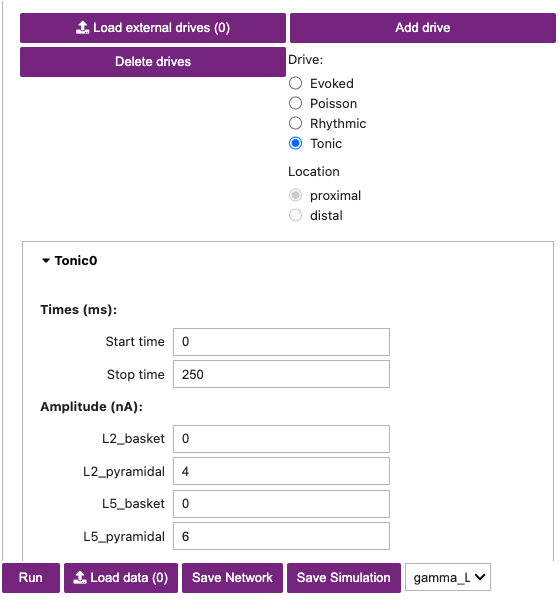
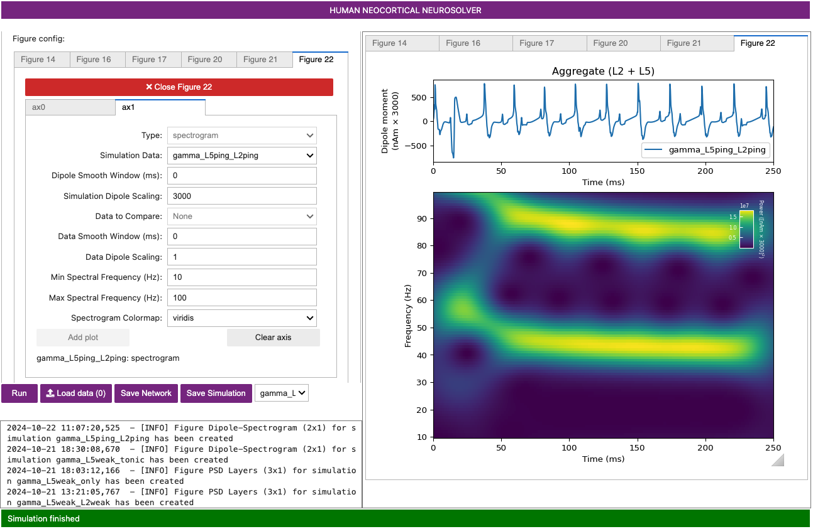
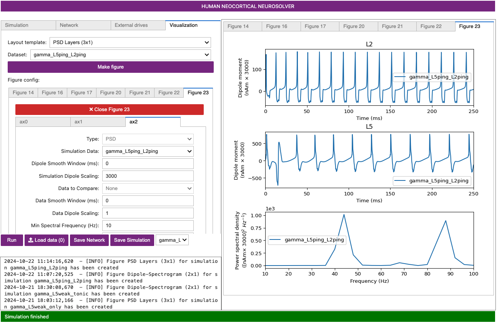
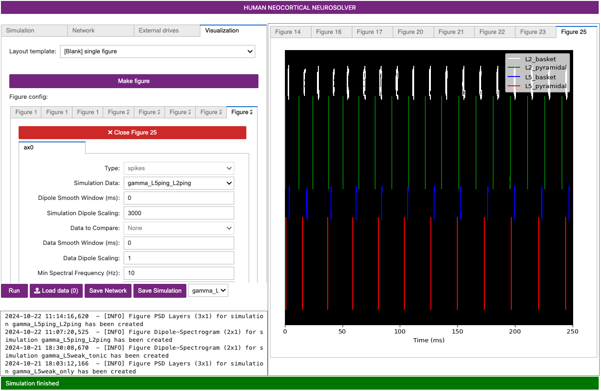
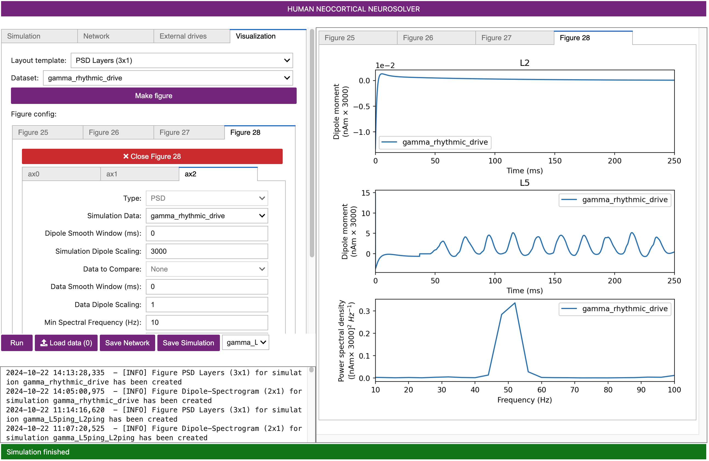
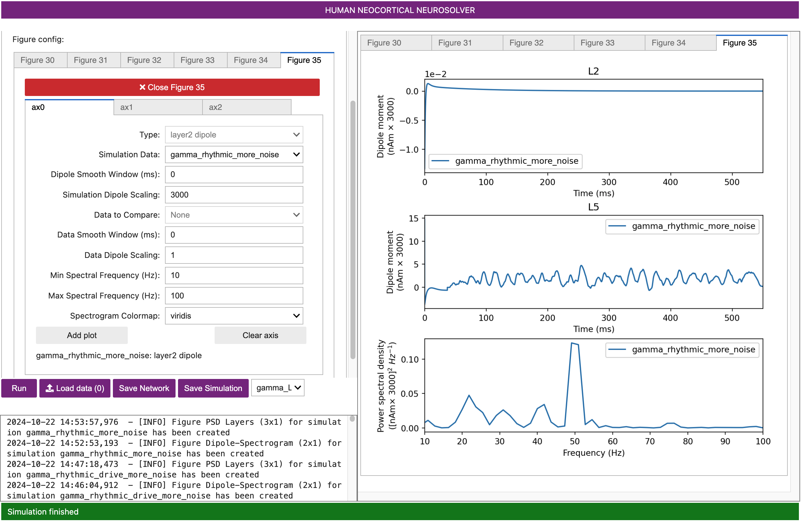

# Gamma Rhythms (30-80 Hz)

## Getting Started.

In order to understand the workflow and initial parameter sets provided with this tutorial, we must first briefly describe prior studies on the mechanistic origin of gamma rhythms, including our prior modeling work that led to the creation of the parameter sets you will work with [1].

Gamma rhythms can encompass a wide band of frequencies from 30-150 Hz. Here, we will focus on the generation of so called low gamma rhythms in the 30-80 Hz range. It has been well established through experiments and computational modeling that these rhythms can emerge in local spiking networks through interactions of excitatory cell and inhibitory cell interactions, with the period of the oscillation set by the time constant of decay of GABAA-mediated inhibitory currents [2–4], a mechanism that has been referred to as pyramidal-interneuronal gamma (PING). In normal regimes, the decay time constant of GABAA-mediated synapses (~25 ms) bounds oscillations to the low gamma frequency band (~40 Hz).

In general, PING rhythms are initiated by “excitation” to the excitatory (E) cells that causes spiking, which in turn synaptically activates a spiking population of inhibitory (I) cells. In turn, these I cells inhibit the E cells, preventing further E cell activity until the E cells can overcome the effects of the inhibition (~25 ms later). The pattern is repeated, creating a gamma frequency oscillation (~40 Hz, 40 spikes/second). This general principle is schematically described in Figure 1 below. The frequency of the rhythm is paced by this time constant of decay of inhibition, which is mediated by strong GABA-A currents, as well as the excitability of the E cells (if the E cells are very excitable, they can fire before the inhibition has completely worn off, and the oscillation will be faster).

<div class="stylefig" style="max-width:450px;">

<h3>Figure 1</h3>

<p><a href="https://raw.githubusercontent.com/jonescompneurolab/hnn-tutorials/master/gamma/images/image19.png"></a></p>

<p style="text-align:center;">Schematic illustration of the circuit mechanisms underlying PING rhythms. </p>

</div>

In this tutorial, we will explore the generation of PING rhythms in the HNN model.  We will provide example parameter files and walk through simulations that generate low-frequency gamma activity in both Layers 2/3 and Layer 5, as in [1]. This tutorial relies on a different type of exogenous drive to “activate” the local network than the other tutorials. Here, the necessary excitation to generate spiking in the pyramidal neurons (E cells) that initiates the rhythm (see PING description above) is provided by a continuous train of action potentials with a Poisson distribution (Poisson Input) that activate post-synaptic excitatory AMPA synapses on the pyramidal neurons. This Poisson drive causes the pyramidal neurons to fire, dependent on the chosen conductance of the AMPA currents. The inhibition in the network is strong enough to overcome the Poisson drive and entrain the network spiking into a gamma frequency rhythm.

Of note, gamma rhythms can be generated by circuit mechanisms other than PING, including subthreshold rhythmic exogenous drive. Lee and Jones (2013) examined various mechanisms of generation of gamma activity and described ways to distinguish the mechanisms of generation based on features of current dipole signal [1]. After completing this tutorial, we encourage you to explore alternate mechanisms of gamma generation and to compare to your own gamma data.

## Tutorial Table of Contents

0. [Setup](#toc_0)

1. [Load/view parameters to define network structure & to “activate” the network](#toc_1)

2. [Run the simulation and visualize net current dipole](#toc_2)

3. [Calculating and Viewing Spiking Activity and Power Spectral Density (PSD)](#toc_3)

4. [Adjusting parameters](#toc_4)

5. [Have fun exploring your own data!](#toc_5)

<a id="toc_1"></a>

## 0. Setup

The following tutorial will utilize the HNN-Core GUI. 

To install the latest version of the HNN-Core GUI, we recommend creating a new Python (or conda) virtual environment, and then running the appropriate command below within your environment:

#### For bash/Powershell
```bash
pip install --pre hnn-core[gui]
```

#### For zsh
```bash
pip install --pre hnn-core'[gui]'
```

If you need further assistance with installation, please see the installation instructions in our [HNN-Core documentation](https://jonescompneurolab.github.io/hnn-core/dev/index.html).

Next, you can launch the GUI from within your environment with the following command:
```bash
hnn-gui
```

This will open the GUI in your local browser, as shown below

<div style="display:block; width:90%; max-width:800px; margin: 0 auto;">


</div>

Configuration files that will simulate PING rhythms as described in the Getting Started section above are provided in the <a href="https://github.com/jonescompneurolab/hnn-data">hnn-data GitHub repository</a>. You will need to either clone the hnn-data repository or download its contents to your machine to follow along with this tutorial. The configuration file we will begin with is `gamma_L5weak_L2weak.json`.

Before we load in the configuration file, let's update the parameters in the `Simulation` tab. 

If you have the [MPI backend](https://jonescompneurolab.github.io/hnn-core/stable/parallel.html) for parallel simulations installed, you can change the backend from Joblib to MPI for faster simulation times. Otherwise, you can leave this option as is. We will keep `Trials` (the number of trials to simulate) as 1 and the integration timestep `dt (ms)` as 0.025 for now. Next, we will change the `tstop (ms)` parameter to 250 for a longer simulation. Lastly, we will change the `Name` to `gamma_L5weak_L2weak` to refect the network configuration we'll be starting with. 

## 1. Load/view parameters to “activate” the network and to define the network structure

To load the initial parameters for the inputs that drive our network, navigate to the `External Drives` tab and click `Load External Drives`. From the popup window, navigate to the 'network-configurations' subfolder in the 'hnn-data' directory, and select the `gamma_L5weak_L2weak.json` configuration file. 

You should now see a dropdown menu labelled 'extpois (proximal)' which contains the adjustable drive parameters, as shown in Figure 2 below.

#### Figure 2

<div style="display:block; width:90%; max-width:800px; margin: 0 auto;">


</div>

In this simulation, the network will be “activated” with excitatory AMPA synaptic input, distributed in time as a Poisson process and delivered to the somas of the pyramidal neurons in Layer 2/3 (L2/3) and Layer 5 (L5). This noisy input will generate spiking activity in the pyramidal neurons that can initiate the PING rhythm. 

### Load Network Parameters

Next, navigate to the `Network` tab and select `Load local network connectivity`. From the popup window, select the `gamma_L5weak_L2weak.json` configuration file from the 'network-configurations' subfolder in the 'hnn-data' directory. 

The adjustable network parameters are displayed in the dropdown boxes under the `Connectivity` tab, as shown in Figure 3 below. 

#### Figure 3

<div style="display:block; width:90%; max-width:800px; margin: 0 auto;">


</div>

In our loaded configuration file, all synaptic connections within the network are turned off (weight = 0 $\mu S$), except for the reciprocal connections between the excitatory (AMPA only) and inhibitory (GABAA only) cells within the same layer. In other words, the Layer 2/3 and Layer 5 networks are not connected to each other (see the [Under the Hood](https://hnn.brown.edu/under-the-hood/) section of the HNN website for further details on connectivity structure). 

Note also that the inhibitory conductances within layers are stronger than the excitatory conductances, and there are also strong inhibitory-to-inhibitory (i.e., basket-to-basket) connections. This strong autonomous inhibition will cause synchrony among the basket cells, and hence strong inhibition onto the pyramidal neurons (note: this synapse was not depicted in Figure 1).

:exclamation: Keep in mind that because Layer 2/3 and Layer 5 are not connected, this is not a biologically realistic network. We use this configuration as a starting point for illustrative purposes only, as it will prevent pyramidal-to-pyramidal interactions from disrupting the gamma rhythm.

## 2. Run the simulation and visualize net current dipole

Now that we have set our Simulation parameters and loaded in both our external drives and our network configuration, we are ready to run our simulation. To do so, click the `Run` button. 

:exclamation: Note that each new simulation you run will require a unique simulation `Name` as indicated in the `Simulation` tab. If you have run a simulation under the same name previously, you will get an error message stating that the simulation has failed.

The console below the `Run` button will print progress as the simulation is running. Once it is complete, the input histogram and the dipole will be plotted in the right-most panel, as shown in Figure 4 below.

#### Figure 4

<div style="display:block; width:90%; max-width:800px; margin: 0 auto;">


</div>

A histogram displaying the Poisson drive to the excitatory cells is shown in the top panel, displaying no clear rhythmicity at the gamma frequency. 

We will show the spiking plot in the next section, but for now keep in mind that the Poisson drive provided causes pyramidal neurons to fire, which in-turn cause the inhibitory neurons to fire. Feedback inhibition from the interneurons to the pyramidal neurons generates a regular gamma rhythm via the PING mechanism described above, which we can see in the rhythmicity of the simulated dipole. The sharp downward deflections in the dipole are reflective of the strong inhibition onto the pyramidal neuron somas, which pulls current flow down the dendrites.

To view the Spectrogram, select the `Visualization` tab. You will see a `Layout template` menu at the top, also shown in Figure 4 above. From this menu, select the `Dipole-Spectrogram (2x1)` option and then click the `Make Figure` button. This will generate a new figure, as shown below

#### Figure 5

<div style="display:block; width:90%; max-width:800px; margin: 0 auto;">


</div>

The spectrogram confirms that, for this network and drive configuration, the dipole signal contains oscillatory components in the gamma range (~50 Hz).

<a id="toc_3"></a>

## 3. Calculating and Viewing Spiking Activity and Power Spectral Density (PSD)

We can make a new figure to view the spiking activity generated by the different neuron populations in the network. 

From the `Layout template` menu in the `Visualization` tab, select `[Blank] single figure` and click the `Make figure` button. This will open up a new figure tab with a single subplot named `ax0`. Under the `Type` dropdown box, select `spikes` and click `Add plot`, as shown in Figure 6 below. 

#### Figure 6

<div style="display:block; width:90%; max-width:800px; margin: 0 auto;">


</div>

Notice that the excitatory pyramidal neurons in each layer (green and red dots / lines) fire before the inhibitory basket cells in each layer (white, blue dots / lines). The pyramidal neuron firing drives the basket cells to fire. The basket cells are highly synchronous due to the strong inhibitory-to-inhibitory connections. The basket cells then prevent the pyramidal neurons from firing for ~25 ms, generating the PING rhythms. The pyramidal neurons are firing periodically, but with lower synchrony due to the Poisson drive, which creates randomized spike times across the populations (once the inhibition sufficiently wears off). This type of dispersed pyramidal neuron firing is considered “weak” PING - hence the configuration file name including "weak" in the name.

We can further confirm that this oscillation is in the gamma frequency range by viewing the power spectral density of the current dipole signal (average spectrogram across time).

To view the PSD from this simulation, select the `PSD Layers (3x1)` option from the `Layout template` menu in the `Visualization` tab, and click the `Make figure` button.

#### Figure 7

<div style="display:block; width:90%; max-width:800px; margin: 0 auto;">


</div>

Notice that the power in the gamma band is smaller in Layer 2/3 than in Layer 5. This is reflective, in part, of the fact that the length of the Layer 2/3 pyramidal neurons is smaller than Layer 5, and hence Layer 2/3 cells produce smaller current dipole moments that can be masked by activity in Layer 5 (see [1] for further discussion).

<a id="toc_4"></a>

## 4 Adjusting parameters

In the following sections, we explore parameter alterations influencing the generation of gamma rhythms.

In **Section 4.1**, we'll use HNN to explore the impact of two key parameters controlling gamma rhythmicity: cell excitability and network connectivity

In **Section 4.2**, we'll show that gamma can also be generate with only tonic inputs to the pyramidal neurons. 

### 4.1.1 Adjusting cell excitability

Cell “excitability” can be adjusted in many ways, reflecting the intrinsic properties of a neuron (e.g. membrane resting potential) and/or the influence of external factors such as noisy background inputs or tonic drive via neuromodulation. Parameters controlling network connectivity include the synaptic connection strengths between cells and/or the time constants of synaptic activation. Here, we explore the influence of a few of these factors on gamma rhythmicity. To do so, we will examine activity in only one of the layers, namely Layer 5, by setting all inputs and connectivity in Layer 2/3 to zero.

First, navigate to the `Simulation` tab and change the `Name` to reflect the fact that we will be running a new simulation. We'll use the name `gamma_L5weak_only`. 

Next, navigate to the `Connectivity` section under the `Network` tab and change all of the Layer 2/3 weights to 0.

Finally, select the `extpois (proximal)` drive under the `External drives` tab and set the Layer 2/3 weights to 0. 

Once you've set all of the Layer 2/3 weights to zero, click the `Run` button to run the simulation. The simulation will yield a gamma rhythm that looks similar to the one we observed previously, as shown in Figure 8 below.

#### Figure 8

<div style="display:block; width:90%; max-width:800px; margin: 0 auto;">


</div>

However, if you view the Simulation Spiking Activity and the PSD (see step 3 above) you will see activity from only Layer 5. 

You can follow the same steps as outlined in Section 3 above to generate these visualizations. Note, however, that you need to have the correct simulation selected via the `Dataset` dropdown box under the `Vizualization` tab and above the `Make figure` button, as shown in Figure 9b below. 

#### Figure 9.A

<div style="display:block; width:90%; max-width:800px; margin: 0 auto;">


</div>

#### Figure 9.B

<div style="display:block; width:90%; max-width:800px; margin: 0 auto;">


</div>

Notice the weak PING rhythm in Layer 5 consisting of weakly synchronous pyramidal neuron firing, followed by synchronous inhibitory neuron firing, that gates the network dipole rhythm to ~50 Hz.

To examine the impact of cell excitability on gamma expression, we can increase the excitability of the Layer 5 pyramidal neurons by adding a tonic applied current that might represent a neuromodulatory influence. 

To do so, first select the `External drives` tab, then select the `Tonic` option under `Drive` and click the `Add drive` button. This will create a new external drive titled `Tonic1`, as shown in Figure 10 below. Select the new drive, and then set the aplitude of the tonic drive to the Layer 5 pyramidal neuron to be 6 nA. This level of injected current will be applied to the soma of the L5 Pyramidal neurons for the duration of the simulation. 

#### Figure 10.A

<div style="display:block; width:90%; max-width:800px; margin: 0 auto;">


</div>

#### Figure 10.B

<div style="display:block; width:90%; max-width:800px; margin: 0 auto;">


</div>

After adding the tonic drives, change the simulation name to `gamma_L5weak_tonic`, and then click the `Run` button. The simulation will yield the output shown in Figure 11 below. 

#### Figure 11.A

<div style="display:block; width:90%; max-width:800px; margin: 0 auto;">


</div>

#### Figure 11.B

<div style="display:block; width:90%; max-width:800px; margin: 0 auto;">


</div>

#### Figure 11.C

<div style="display:block; width:90%; max-width:800px; margin: 0 auto;">


</div>

The oscillation as seen in the dipole is more regular with less noise due to the fact that the tonic drive is strong and outweighs the influence of the Poisson drive. 

Note in the spike plot that the Layer 5 pyramidal neurons are now firing nearly synchronously. They, in turn, synchronously activate the inhibitory basket neurons, which then inhibit the pyramidal neurons for ~20 ms. After ~20 ms, the tonic drive outweighs the inhibition and the pyramidal neurons fire again, creating a ~50 Hz PING rhythm. 

This type of synchronous rhythm is sometimes referred to as “strong” PING. Notice that there is also a ~90 Hz component to the dipole spectrogram. Inspection of the dipole waveform shows that this 90 Hz activity does not represent a separate rhythm, but rather reflects the dipole waveform shape, which has a fast oscillation on each cycle of the slower rhythm due to the strong downward currents induced by somatic inhibition on the pyramidal neurons.

### 4.1.2 Adjusting network connectivity

**Weakening the excitatory connections**

We’ll now explore the impact of adjusting synaptic connectivity parameters in the network. 

First navigate to the `Connectivity` section of the `Network` tab. From there, change the weight of the `L5_pyramidal->L5_basket` connection from 0.00091 to 0.000091, making it 10 times weaker. 

Change the `Name` of the simulation to `gamma_L5weak_tonic_02`, and run the simulation. As we've done in previous sections, you'll want to generate visualizations that show the spike plot and the spectrogram. In Figure 12.B, we display the spiking and the spectrogram in a single plot rather than two separate plots.

#### Figure 12.A

<div style="display:block; width:90%; max-width:800px; margin: 0 auto;">


</div>

#### Figure 12.B

<div style="display:block; width:90%; max-width:800px; margin: 0 auto;">


</div>

It is also instructive to view visualizations for different simulations in the same figure to compare differences. Figure 13 below shows the PSD for `gamma_L5weak_tonic` (top subplot) and `gamma_L5weak_tonic_02` (bottom subplot)

#### Figure 13

<div style="display:block; width:90%; max-width:800px; margin: 0 auto;">


</div>

Notice that the gamma rhythm has now slowed from ~45 Hz to ~40 Hz. This slowing is due to the fact that the excitatory-to-inhibitory connection was weakened. Due to this change, it now takes longer for the basket cells to respond to the excitation, and hence the rhythm is slowed. 

**Removing the inhibitory connections**

Next, we’ll explore the importance of the inhibitory connections in setting gamma rhythmicity. 

First from the `Network` section of the `Connectivity` tab, change the weight of the `L5_pyramidal->L5_basket` connection back to 0.00091.

Then navigate to the `External drives` tab and select the `Tonic1` drive. Click the `Delete drive` button to remove this drive.

We are now back to the Layer 5 weak PING configuration (`gamma_L5weak_only`) that we simulated previously.

Next, let's experiment with remove the inhibitory-to-inhibitory connections. To do so, navigate to the `Network` section of the `Connectivity` tab and change the weight of the `L5_basket->L5_basket` connection from 0.0075 to 0

From the `Simulation` tab, change the `Name` to  `gamma_L5weak_only_noinh` and click the `Run` button. Then create new visualizations to show the spike plot and the spectrogram for your simulation, as shown in Figure 14 below. 

#### Figure 14.A

<div style="display:block; width:90%; max-width:800px; margin: 0 auto;">



</div>

#### Figure 14.B

<div style="display:block; width:90%; max-width:800px; margin: 0 auto;">


</div>

Notice that the rhythm is still present but less regular and noisier (compare with first waveform image in this section 4.1 above). You can also observe this in the Simulation Spiking Activity (below). This lack of regularity is due to the fact that removal of the inhibitory to inhibitory connections caused the inhibition to be less synchronous and noiser, in turn yielding a noisier PING rhythm.

**Reducing the GABAB decay time**

Lastly, we’ll show that the time constant of inhibitory decay is an essential parameter controlling the frequency of the PING rhythm. 

In the `Network` section of the `Connectivity` tab, change the weight of the `L5_basket->L5_basket` connection back to 0.0075

Next, select the `Cell parameters` section of the `Network` tab. Set the `Cell type` to `L5 Pyramidal` and the `Cell Properties` to `Synapses`, then change the `GABAA decay time` from 5.0 ms to 2.0 ms, as shown in Figure 15 below.

#### Figure 15

<div style="display:block; width:90%; max-width:800px; margin: 0 auto;">


</div>
:exclamation: Note in these simulations the weights of the GABAB synapses are all set to zero

From the `Simulation` tab, change the `Name` to  `gamma_L5weak_only_fasterinh` and click the `Run` button. Then create new visualizations to show the spike plot and the spectrogram for your simulation, as shown in Figure 16 below. 

#### Figure 16.A

<div style="display:block; width:90%; max-width:800px; margin: 0 auto;">


</div>

#### Figure 16.B

<div style="display:block; width:90%; max-width:800px; margin: 0 auto;">



</div>

Notice that the rhythm is now faster at ~ 60 Hz. As illustrated in the spiking activity, the faster decay of inhibition allows the pyramidal neurons to recover more quickly from the inhibition and respond to the Poisson drive, resulting in a faster network oscillation.

### 4.1.1 Exercises for further exploration

* How else might the excitability of the cells be adjusted? What happens to the network dynamics? Can you make the oscillation faster or slower?

* How else might the synaptic connections in the network be adjusted to impact gamma? What happens to the network dynamics? Can you make the oscillation faster or slower?

* Gamma rhythms can be created in neworks where the pyramidal neurons do not fire on their own but their activity is still regulated by interneuron firing (interneuron mediated gamma: ING). Can you adjust parameters to create such an oscillation in the network?

### 4.2 Only tonic inputs to pyramidal neurons can also generate gamma

The next exercise involves setting up a PING rhythm in both Layer 2/3 and Layer 5 by providing tonic inputs to the pyramidal neurons, as opposed to the stochastic Poisson inputs described above. To do so, we will apply a constant depolarizing current injection to the soma of neurons, representative of a “tonic input”.

Navigate to the `Network` tab and load the `gamma_L5ping_L2ping.json` configuration file. Then select the `External drives` tab and similarly load in the `gamma_L5ping_L2ping.json` file. 

Next, we will add a tonic input to the pyramidal neurons in Layer 2/3 and Layer 5 will generate spiking that initiates PING. 

From the `External drives` tab, set the `Drive` parameter to `Tonic` and click the `Add drive` button. A new `Tonic0` dropdown will appear. From the dropdown, set `L2_pyramidal` to 4, and set `L5_pyramidal` to 6, as shown in Figure 17 below.

:exclamation: Note that only the pyramidal neurons are set to receive depolarizing current injections (i.e., our tonic inputs)

#### Figure 17

<div style="display:block; width:90%; max-width:800px; margin: 0 auto;">



</div>

Next, change the `Name` in the `Simulation` tab to `gamma_L5ping_L2ping` and click the `Run` button to run the simulation. 

Once completed, navigate to the `Visualization` tab and set the `Layout template` to `Dipole-Spectrogram`. Make sure you've sected the proper `Dataset` (`gamma_L5ping_L2ping`), and then click the `Make figure` button. You will see an ourput similar to that shown in Figure 18 below. 

#### Figure 18

<div style="display:block; width:90%; max-width:800px; margin: 0 auto;">



</div>

In this simulation, there are no spiking inputs provided to the model; instead, a current clamp provides a constant depolarizing current to the pyramidal neuron somas, causing the cells to fire. This firing initiates the PING rhythm through mechanisms similar to that described above. In contrast to the Poisson drive, the constant depolarization to pyramidal neurons creates higher excitability in the pyramidal neurons, causing more synchronous firing. In turn, this causes the interneurons to fire synchronously, producing a higher amplitude gamma oscillation. 

In Figure 18 above we see that the dipole displays even sharper downward deflections, caused by the strong synchronous inhibition onto the pyramidal neuron somas that pulls current flow down the dendrites. This PING rhythm has less variability and would thus be considered “strong” PING rather than “weak” PING.

Let's further explore this simulation by looking at the layer-specific dipoles and the PSD. To generate this visualization, select the `PSD Layers` option from the `Layout template` dropdown in the `Visualization` tab. Make sure you've sected the proper `Dataset` (`gamma_L5ping_L2ping`), and then click the `Make figure` button. You will see an ourput similar to that shown in Figure 19 below. 

#### Figure 19

<div style="display:block; width:90%; max-width:800px; margin: 0 auto;">



</div>

When looked at together, the spectrogram (Figure 18) and the PSD (Figure 19) illustrate that the dipole signal contains strong oscillatory components in the gamma range in the net dipole, which is being driven by the strong Layer 5 activity. Layer 2/3 is oscillating at higher frequency with a lower amplitude (note the scaling of the y-axes in the layer-specific dipoles).

:exclamation: Keep in mind that Layer 2/3 and Layer 5 are not synaptically connected to each other in this simulation

A closer look at the spiking activity will reveal the mechanisms creating these waveform shapes, as shown in Figure 20 below 

#### Figure 20


<div style="display:block; width:90%; max-width:800px; margin: 0 auto;">



</div>

The PING mechanism is seen in each layer where the pyramidal neurons fire, causing the inhibitory neurons to fire, which consequently keep the pyramidal neurons from firing until their excitation outweighs the inhibition. Notice that the firing rate of Layer 2/3 pyramidal and basket neurons is faster than that of Layer 5 neurons. This is because although the Layer 2/3 pyramidal neurons receive a lower current injection, they have shorter dendrites and therefore the current flow up and down the dendrites is faster. Further, the Layer 2/3 pyramidal neurons have lower spiking thresholds due to their intrinsic properties.

In each layer, the inhibitory neurons are firing synchronously and causing strong somatic inhibition on the pyramidal neurons, resulting in fast downward current flow that creates the sharp dipole deflections seen in the dipole waveforms above. 

:exclamation: While not shown in the figures above, there is an additional higher-frequency component near 80 Hz in Layer 5 that can be seen in the layer-specific PSD. The higher-frequency activity in Layer 5 comes from the sharp deflections in the dipole waveform along with a small-amplitude peak that together create high power at 80 Hz in the frequency domain. These deflections are driven by the strong depolarizing current on the pyramidal neurons that causes their voltage to rise quickly even before the inhibitory neurons fire. 

As an exercise, play with the current injection amplitude provided to the different neurons to see how it affects the generated rhythm.

### 4.3 Gamma through rhythmic subthreshold synaptic inputs to pyramidal neurons

In the next example, we will apply 50 Hz rhythmic synaptic inputs through proximal and distal projection patterns to produce gamma oscillations similar to those shown in Figure 8A of (Lee & Jones, 2013) [1]. 

In this simulation, the strength of the input is set so that the cells remain subthreshold and gamma rhythms emerge from subthreshold current flow in the pyramidal neuron dendrites, rather than local spiking interactions as in the PING mechanisms described above.

First, navigate to the `Network` tab and load the `gamma_rhythmic_drive` configuration from the `hnn_data` folder. Next, select the `External drives` tab and similarly load the subthreshold drives from the `gamma_rhythmic_drive` file. You will see two drives named `bursty1 (proximal)` and `bursty2 (distal)`

In this example, the pyramidal neurons receive inputs, and the interneurons do not. The proximal and distal inputs start at 50.0 and 55.0 ms, respectively, and are slightly out of phase to allow synaptic inputs to effectively push current flow up the dendrites, followed 5 ms later by current flow down the dendrites. Additionally, the input frequency (as indicated by the `burst rate` parameter) for both proximal and distal inputs is set to a 50 Hz, representing “bursts” of excitatory synaptic input. The driving burst has an inter-burst-interval of 20 ms, with minimal noise within each driving burst (as indicated by the `Burst std dev` of 2.5 ms). 

:exclamation: For a detailed description of the driving bursts, please review the Alpha/Beta tutorial.

 Note also that the amplitude of the inputs, which are only provided to the Layer 5 pyramidal neurons, is set to a small value 0.00004, which produces only subthreshold responses in the Layer 5 pyramidal neurons. As a result, the gamma mechanism shown in this simulation is fundamentally different from the previous examples, since it does not rely on the local spiking interactions that underlie the PING mechanism.

Next, change the `Name` in the `Simulation` tab to `gamma_rhythmic_drive` and click the `Run` button to run the simulation. 

Once completed, navigate to the `Visualization` tab and set the `Layout template` to `Dipole-Spectrogram`. Make sure you've sected the proper `Dataset` (`gamma_L5ping_L2ping`), and then click the `Make figure` button. Similarly, we'll generate the PSD vizualization nby selecting `PSD Layers` from the `Layout template` and then clicking the `Make figure` button. You will see outputs similar to those shown in Figure 21 below. 

#### Figure 21.A

<div style="display:block; width:90%; max-width:800px; margin: 0 auto;">


</div>

#### Figure 21.B

<div style="display:block; width:90%; max-width:800px; margin: 0 auto;">



</div>

The net dipole signal in this simulation shows a clear gamma rhythm at ~50 Hz, produced by the Layer 5 pyramidal neurons. Note, here the Layer 2/3 pyramidal neurons are not receiving any drive and hence do not contribute to the dipole current. There is only minor stochasticity to the synaptic inputs (burst stdev of 2.5 ms). Also note that the waveform shape in this simulation is distinct from the previous examples, lacking the sharp deflections produced by neuronal firing and strong somatic inhibition during PING.

### 4.4 Gamma through rhythmic subthreshold synaptic inputs to pyramidal neurons, with additional noise

In the final simulation of this section, we will add more noise to the previously applied 50 Hz rhythmic drive.

For each of the drives in the `External drives` tab, change the value of the `Burst std dev` from 2.5 ms to 5 ms. This increase adds variability to the timing of the burst of synaptic drive each input provides, and hence adds more “noise” to the network.

Next, change the `Name` in the `Simulation` tab to `gamma_rhythmic_more_noise` and click the `Run` button to run the simulation. 

Once completed, navigate to the `Visualization` tab and set the `Layout template` to `Dipole-Spectrogram`. Make sure you've sected the proper `Dataset`, and then click the `Make figure` button. Similarly, we'll generate the PSD vizualization by selecting `PSD Layers` from the `Layout template` and then clicking the `Make figure` button. You will see outputs similar to those shown in Figure 22 below.

#### Figure 22.A

<div style="display:block; width:90%; max-width:800px; margin: 0 auto;">


</div>

#### Figure 22.B

<div style="display:block; width:90%; max-width:800px; margin: 0 auto;">



</div>

Due to the higher variability in synaptic input timing, there is now more variability in the temporal dynamics and frequency content seen in the dipole signal in the simulation above. This is seen in the intermittent 50 Hz gamma events visible in the wavelet spectrogram. 

With the added noise, we also observe lower-frequency peaks with relatively high power in the average PSD, though the intermittent gamma events still yield the highest-power peak observed in the PSD.

### 4.4.1 Exercises for further exploration

* Go back to the `gamma_L5weak_L2weak` configuration and add recurrent synaptic connectivity between pyramidal neurons within a layer (e.g., L5 Pyr -> L5 Pyr weight = 0.00091e-4); how does that change influence the gamma rhythm? What happens as you change the strength of this connection?

* Adjust the synaptic time constants of GABAA or other synapses; can you alter the peak gamma frequency?

* Add connectivity between Layer 2/3 and Layer 5? Is gamma rhythmicity retained? Under what circumstances might gamma persist?

## 5. Have fun exploring your own data!

We have not observed strong gamma activity in our SI dipole data, and as such have not provided an example data set to compare simulation results to, as in the other tutorials. However, simulation results can be compared to recorded data, as described in the ERP and Alpha/Beta tutorials. Follow steps 1-4 above using your data and parameter adjustments based on your own hypotheses.

## References

1. Lee, S. & Jones, S. R. Distinguishing mechanisms of gamma frequency oscillations in human current source signals using a computational model of a laminar neocortical network. Front. Hum. Neurosci. 7, 869 (2013).

2. Cardin, J. A. et al. Driving fast-spiking cells induces gamma rhythm and controls sensory responses. Nature 459, 663–667 (2009).

3. Vierling-Claassen, D., Cardin, J. A., Moore, C. I. & Jones, S. R. Computational modeling of distinct neocortical oscillations driven by cell-type selective optogenetic drive: separable resonant circuits controlled by low-threshold spiking and fast-spiking interneurons. Front. Hum. Neurosci. 4, 198 (2010).

4. Buzsáki, G. & Wang, X.-J. Mechanisms of gamma oscillations. Annu. Rev. Neurosci. 35, 203–225 (2012).
