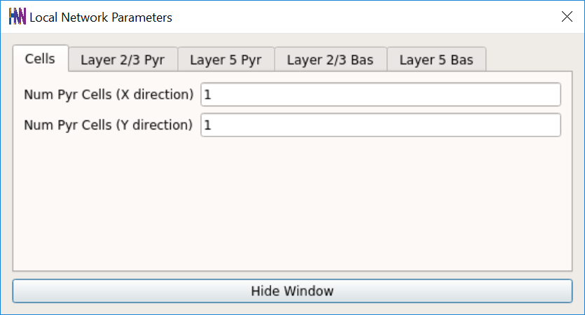
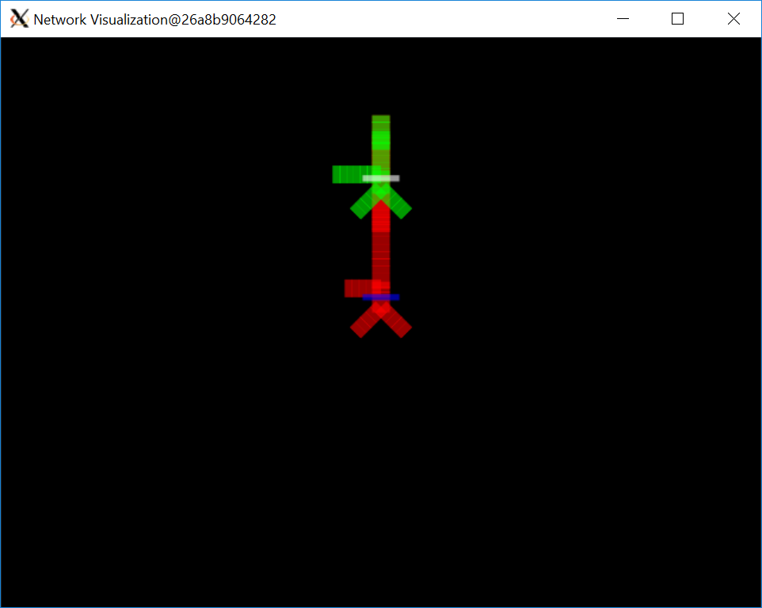
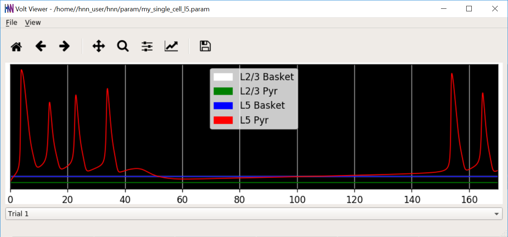
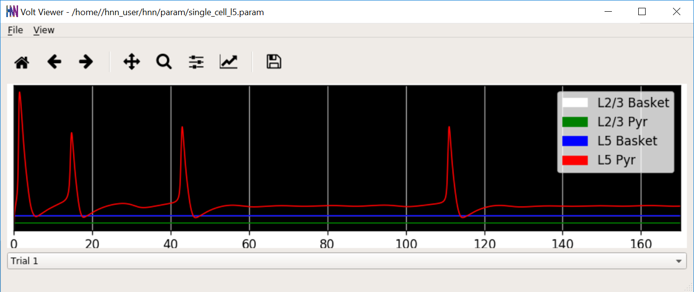

# Single Cell Neural Dynamics

While HNN includes the necessary functionality for modeling detailed biophysical networks in the human neocortical cortex, it can also be used to examine single cell dynamics using the same detailed Hodgkin-Huxley biophysical model. This tutorial will examine the spiking behavior of layer 2/3 and layer 5 pyramidal neurons in isolation with constant current clamp inputs.

Note that before running/loading new simulations, we first remove the prior simulation(s) by pressing the `Remove Simulation` button at the bottom of the GUI. If we do not do this, both simulation dipoles are displayed (old simulation with the dotted line, new simulation with solid line; see "Tour of the GUI" for more details on simulation control).

## Getting Started

**TODO** Background info here. Perhaps link to existing single cell tutorials

## 1. Layer 2/3 Pyramidal Cell Dynamics

**TODO** Ethan's homework here.

## 2. Layer 5 Pyramidal Cell Dynamics

### 2.1. Load/view parameters to define the network structure & to "activate" the network. 

For the exercise below, we will use the parameter file `single_cell_l5.param`, which can be obtained by clicking [here](https://jonescompneurolab.github.io/hnn-tutorials/single-cell/single_cell_l5.param). After downloading the file, copy it to a location that can be accessed by the HNN GUI. For Docker-based installs, this is the `hnn/param` directory located where you ran the docker-compose command. For example, `~/hnn/installer/mac/hnn/param`.

To load the initial parameter set, navigate to the HNN GUI and click:

`Set Parameters From File`

Then select the file [single_cell_l5.param](https://jonescompneurolab.github.io/hnn-tutorials/single-cell/single_cell_l5.param) from the `hnn/param` folder where the file was copied to above.

This will load a configuration of isolated cells without any network connections between them. The dimensions of the pyramidal so the network is 1x1, and can be verified in the GUI by navigating to `Set Parameters -> Network`.

This can be visualized in the `Model Visualization` button, producing a diagram similar to below, where the green cell represents an L2/L3 pyramidal cell, red represents an L5 pyramidal cell, white is the L2/L3 inhibitory basket cell, and blue is the L5 basket cell. 

If you go through the other tabs in the `Network` menu, you can notice that the weights for each connection are set to 0. Even though the 4 cells mentioned above exist in the model, there are no synaptic connections between them.

We will set a constant current input supplied only to the Layer 5 excitatory pyramidal cell to observe properties of the model that define its intrinsic excitability in the absence of network inputs. To view the default injected current go to the `Set Parameters` window and click on the `Tonic Inputs` button.

Click on the `Layer 5` tab and notice that the amplitude is set to 1 nA. The stop time is set to -1.0 ms, meaning that the injected current will be active for the entire simulation.

Next, change the name of the simulation to `my_single_cell_l5` in the `Set Parameters` window. This will create a new parameter file and preserve the defaults in the downloaded parameter file.

### 2.2 Run the simulation and visualize somatic voltages

With the current input set for a 1x1 network, run a simulation by clicking on the `Run Simulation` button. A dialog box will pop up asking you to confirm overwriting the existing file. Go ahead and press `OK` to start the simulation. A dialogue that the simulation has completed should appear quickly after the model simulates 170 ms. To see the generated voltage plots over time, click on the `View` pull-down menu and select `View Somatic Voltage`.

Note how there's a burst of four spikes, a pause, and then another burst. Observe what happens if you change the current amplitude to 1.0 nA. Now find the minimum amplitude that will still trigger an action potential. How many spikes are in a single burst now?

### 2.3 Change cell biophysical parameters to modify spiking behavior

Since modulating current is not enough to cause one spike per burst, we will look at other cellular parameters that have an influence on spiking behavior.

Leave the current amplitude at a minimum value for generating an action potential and click on `Set Parameters -> Cell` Go to the `L5 Pyr Biophysics` tab and find the parameter `Soma Kv channel density`. Which way would you adjust this to increase the neuron’s capacity for re-polarizing after an action potential?

By adjusting `Soma Kv channel density`, you should obtain a somatic voltage plot similar to below.

To alter spiking behavior even further, and only generate one spike, we need to modify biophysical parameters of the cell dendrites, like we did with the soma above. Click on `Set Parameters -> Cell` and go to the `L5 Pyr Biophysics` tab. Look for `Dendrite Kv channel density` and modify it. It is very easy to create a cell that hyper-polarizes, and prevents more than one action potential within 170 ms. At most, double the dendritic channel density.

You may find that the increased potassium channel density prevents somatic voltage from reaching the action potential threshold. Increase the input current to compensate as necessary. You should end up with a voltage trace showing multiple single spike bursts over the 170 ms duration.

